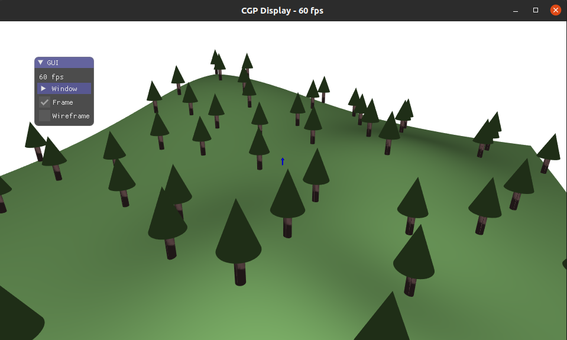

# INF443

Assignments from the course 3D computer graphics at École polytechnique. The projects in this repository were made in C++ using [OpenGL](https://learnopengl.com/Introduction). The repository also contains screenshots showcasing the scenes developed. The [CGP library](https://github.com/drohmer/cgp/tree/main) is used extensively for all scenes.

**Table of content:**
 - [Running locally](#running-locally)
 - [Lab Exercises](#lab-exercises)
    - [Lab 1: Basic 3D scene and shader effects](#lab1)
    - [Lab 2: Phong Shading](#lab2)
    - [Lab 3: 3D modelisation](#lab3)
    - [Lab 4: Textures](#lab4)
    - [Lab 5: Animation](#lab5)
    - [Lab 6: Simulation](#lab6)
 - [Course project](#course-project)

## Running locally

The ***inf443_lab_code*** folder contains all the exercises developed during lab sessions. Makefiles are provided to compile each exercise. In order to run them locally, navigate to an exercise's root folder and run

> make

> ./exercice_name

## Lab Exercises

### Lab 1: Basic 3D scene and shader effects

The objectives of this lab were to insert objects into a 3D scene and play with translations, rotations and shader effects controlled by the simulation's time parameter.

### Lab 2: Phong Shading

In order to visualize depth on the projected image, shading is essencial. In this lab, we developed a [Phong shader](https://en.wikipedia.org/wiki/Phong_shading#:~:text=Phong%20shading%20interpolates%20surface%20normals,and%20the%20Phong%20reflection%20model.) from scratch.

Additionally, a fog effect was added to make objects gradually fade away as distance increases.

### Lab 3: 3D modelisation

In this lab, we explored modeling 3D surfaces using their parametric description. We coded meshes for a 3D terrain and a tree that was then procedurally added at random positions of the terrain in the final scene. Random positions were checked to ensure that trees did not intersect.

### Lab 4: Textures

In this lab, we experimented with applying various textures to different mesh geometries (tiles, toruses, cylinders, terrain).

### Lab 5: Animation

In this lab, we experimented with simple hierarchical transformations to animate motion.

### Lab 6: Simulation

In this lab, we simulated an N particle spring network using explicit Euler for numerical integration of the equations of motion.

## Course Project

The course project has been developed on a [different repository](https://github.com/ArkhamKnightGPC/OpenGL_AncientEgyptProject).
